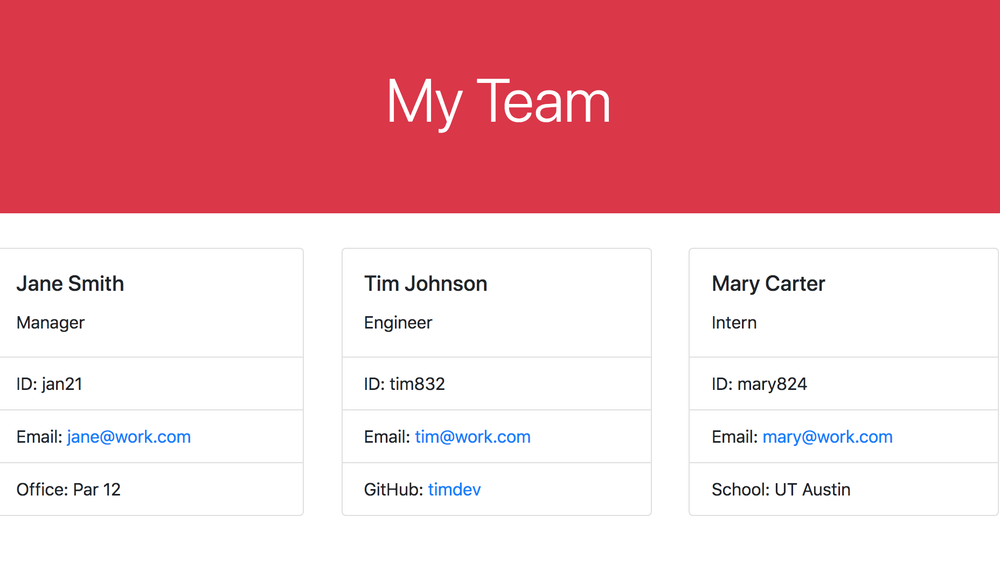

# Team Profile Generator

This node.js application prompts the user to input data about a team of employees. The user can input data for a team manager and subsequent engineers and interns. The entered data is then displayed to a web page.

To use the application, download the repository. Then, type ```npm install``` into the command line to install the necessary packages. From the main directory, type ```node index.js``` into the command line to run the application. Answer the prompts that follow to input team member data. Once you have entered the last team member, the file will be generated. Open the ```index.html``` file in the ```dist``` directory in the browser to see the final page.

To run unit tests, type ```npm test``` into the command line.

To see a walkthrough of these steps, [watch this video.](https://drive.google.com/file/d/1KEPjuUXkOfoV2VEYhW_OHz8676i3xWqw/view)

